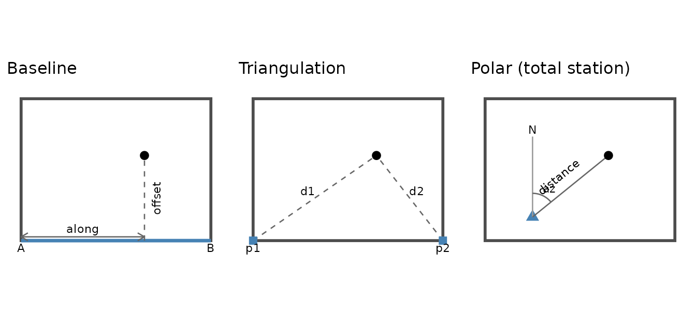
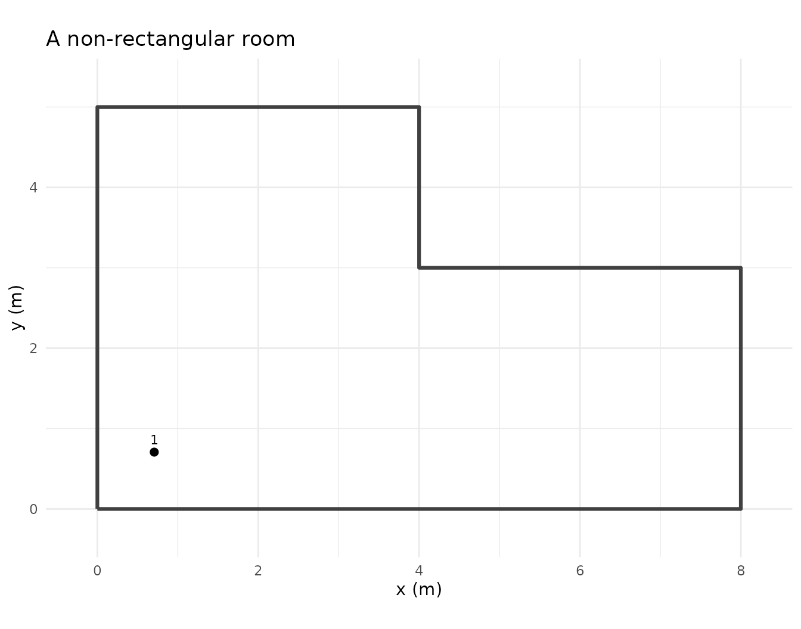
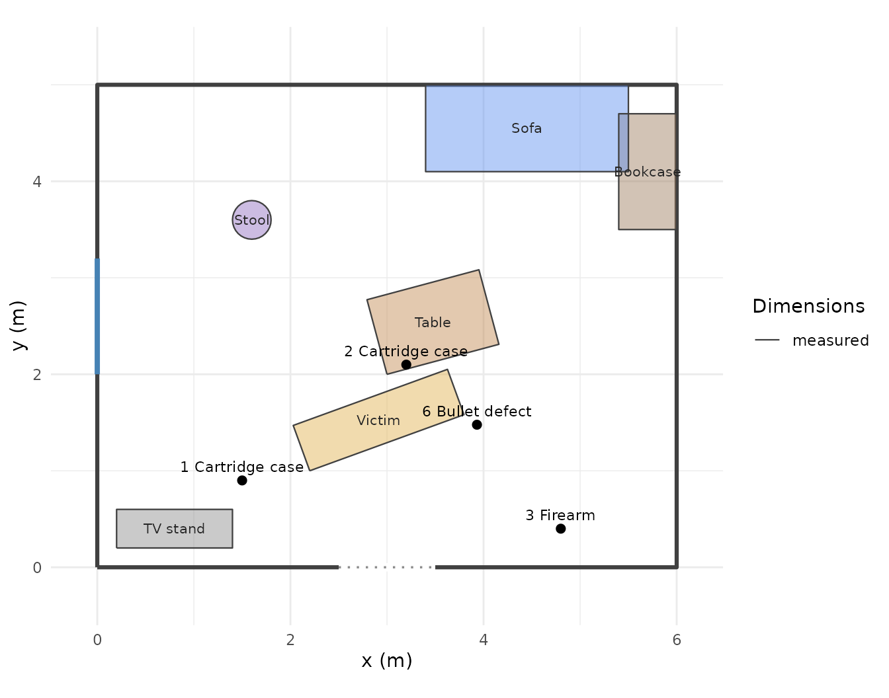
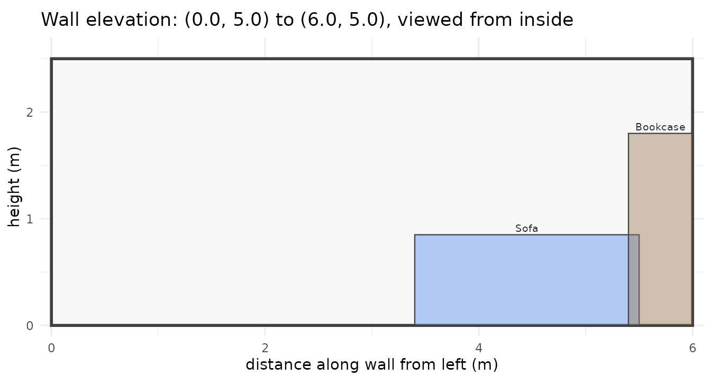
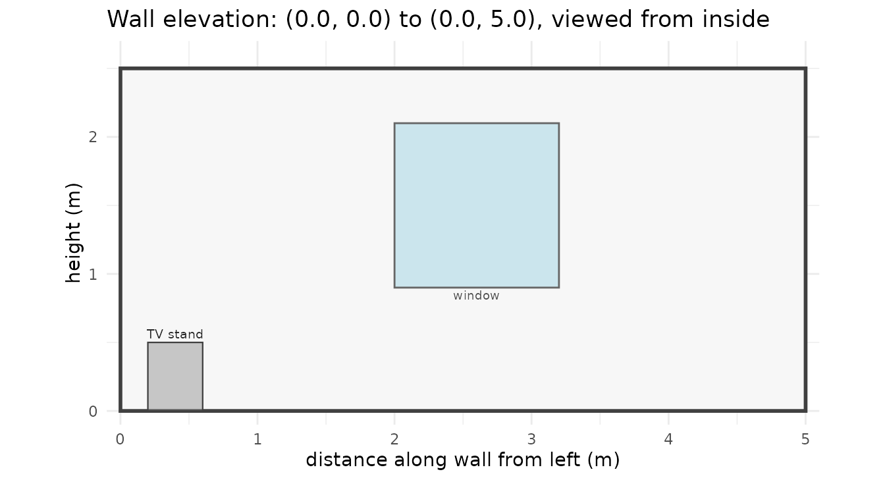

# Scene mapping: from tape measurements to a to-scale diagram

The rough sketch you draw at the scene is the legal record. What
forensicR adds is the step after it: converting the numbers on that
sketch into one consistent coordinate frame, checking that they agree,
and drawing the to-scale plan and elevations from them.

## Conventions

  - **Units**: anything, as long as everything uses the same one. The
    plots label axes with the `units` argument.
  - **Frame**: x increases to the east, y to the north, z upwards from
    the floor. Pick a fixed origin, normally a room corner, and write it
    on the rough sketch.
  - **Azimuth**: degrees clockwise from north. North is 0, east is 90.
  - **Left and right of a wall** always mean *as seen standing inside
    the room facing that wall*.

## The three measurement methods



### Baseline (rectangular coordinates)

Fix a line between two known points, usually two wall corners. For each
item record the distance *along* the line from the origin and the
perpendicular *offset*. Offsets are positive to the **left** when
walking from the origin toward the end point.

``` r
coords_baseline(along = c(1.2, 3.5), offset = c(0.8, 2.1),
                origin = c(0, 0), end = c(6, 0), id = c("A", "B"))
#> # A tibble: 2 × 6
#>   id        x     y     z type     method  
#>   <chr> <dbl> <dbl> <dbl> <chr>    <chr>   
#> 1 A       1.2   0.8    NA evidence baseline
#> 2 B       3.5   2.1    NA evidence baseline
```

The baseline does not have to be along an axis. Any two known points
work, and the conversion handles the rotation:

``` r
coords_baseline(along = 2, offset = 1, origin = c(1, 1), end = c(1, 5))
#> # A tibble: 1 × 6
#>   id        x     y     z type     method  
#>   <chr> <dbl> <dbl> <dbl> <chr>    <chr>   
#> 1 P01       0     3    NA evidence baseline
```

### Triangulation

Two distances from two fixed points. Two mirror-image solutions exist;
`side` picks the one to the left or right of the directed line from `p1`
to `p2`. If the distances cannot meet you get `NA` and a warning.

``` r
coords_triangulation(d1 = c(3, 4), d2 = c(4, 5), p1 = c(0, 0), p2 = c(5, 0), side = "left")
#> # A tibble: 2 × 6
#>   id        x     y     z type     method       
#>   <chr> <dbl> <dbl> <dbl> <chr>    <chr>        
#> 1 P01     1.8  2.4     NA evidence triangulation
#> 2 P02     1.6  3.67    NA evidence triangulation
coords_triangulation(d1 = 1, d2 = 1, p1 = c(0, 0), p2 = c(5, 0))
#> Warning: 1 item cannot be located: distances do not form a triangle.
#> # A tibble: 1 × 6
#>   id        x     y     z type     method       
#>   <chr> <dbl> <dbl> <dbl> <chr>    <chr>        
#> 1 P01      NA    NA    NA evidence triangulation
```

### Polar

Distance and azimuth from an instrument position, for total stations or
compass-and-tape work.

``` r
coords_polar(distance = c(3.6, 5.0), azimuth = c(15, 330), station = c(3, -2))
#> # A tibble: 2 × 6
#>   id        x     y     z type     method
#>   <chr> <dbl> <dbl> <dbl> <chr>    <chr> 
#> 1 P01   3.93   1.48    NA evidence polar 
#> 2 P02   0.500  2.33    NA evidence polar
```

### Checking measurements against each other

The most useful habit: measure a few points by two methods and compare.
Disagreement beyond a few centimetres means a reading or a reference
point is wrong.

``` r
a <- coords_baseline(along = 2.6, offset = 1.8, end = c(4, 0), id = "X (baseline)")
b <- coords_triangulation(d1 = sqrt(2.6^2 + 1.8^2), d2 = sqrt(1.4^2 + 1.8^2),
                          p1 = c(0, 0), p2 = c(4, 0), id = "X (triangulation)")
sqrt((a$x - b$x)^2 + (a$y - b$y)^2)      # closure error
#> [1] 2.220446e-16
```

## Height and type

Every point can carry a height `z` (a defect in a wall, a stain on a
door) and a `type`: `"evidence"` (default), `"defect"` or
`"bloodstain"`. The type only changes how the point is drawn.

``` r
coords_polar(distance = 3.6, azimuth = 15, station = c(3, -2),
             id = "6 Bullet defect", z = 1.35, type = "defect")
#> # A tibble: 1 × 6
#>   id                  x     y     z type   method
#>   <chr>           <dbl> <dbl> <dbl> <chr>  <chr> 
#> 1 6 Bullet defect  3.93  1.48  1.35 defect polar
```

## Walls, doors, windows

`room_rect()` is the quick way to get a rectangle. Any room shape can be
described directly as polylines with columns `x`, `y`, `group` and
`type` (`"wall"`, `"door"` or `"window"`), so an L-shaped room is just a
longer polyline.

``` r
walls <- rbind(
  room_rect(0, 0, 6, 5),
  opening(2.5, 0, 3.5, 0, type = "door"),
  opening(0, 2.0, 0, 3.2, type = "window")
)
lshape <- tibble::tibble(x = c(0, 8, 8, 4, 4, 0, 0), y = c(0, 0, 3, 3, 5, 5, 0),
                         group = "room", type = "wall")
plot_scene(coords_polar(1, 45, id = "1"), walls = lshape) + ggtitle("A non-rectangular room")
```



## Furniture

Objects are footprints with heights. Three ways to place them, matching
how they are measured:

``` r
furn <- rbind(
  along_wall(walls, "north", from = 3.4, length = 2.1, depth = 0.9, id = "Sofa", type = "sofa"),
  along_wall(walls, "east",  from = 0.3, length = 1.2, depth = 0.6, id = "Bookcase", type = "bookcase"),
  furniture("Table", "table", x = 3.0, y = 2.0, width = 1.2, depth = 0.8, angle = 15),
  furniture_from_corners("TV stand", "tv_stand", p1 = c(0.2, 0.2), p2 = c(1.4, 0.6)),
  furniture("Stool", "chair", x = 1.6, y = 3.6, diameter = 0.4, shape = "circle", colour = "#8e6bbf"),
  furniture("Victim", "person_lying", x = 2.2, y = 1.0, width = 1.7, depth = 0.5, angle = 20)
)
furniture_table(furn)
#> # A tibble: 6 × 7
#>   Object   Type         Footprint      Height `Position (x, y)` Angle Dimensions
#>   <chr>    <chr>        <chr>          <chr>  <chr>             <chr> <chr>     
#> 1 Sofa     sofa         2.10 x 0.90    0.85   5.50, 5.00        180   measured  
#> 2 Bookcase bookcase     1.20 x 0.60    1.80   6.00, 3.50        90    measured  
#> 3 Table    table        1.20 x 0.80    0.75   3.00, 2.00        15    measured  
#> 4 TV stand tv_stand     1.20 x 0.40    0.50   0.20, 0.20        0     measured  
#> 5 Stool    chair        circle, 0.40 … 0.90   1.60, 3.60        0     measured  
#> 6 Victim   person_lying 1.70 x 0.50    0.30   2.20, 1.00        20    measured
```

Use `measured = FALSE` for anything whose size was estimated rather than
measured: it is drawn dashed and flagged in the report table. `colour`
and `alpha` (opacity, default 0.45) are per object; `furniture_alpha` in
any plotting function overrides them all at once.

## Plan view

``` r
pts <- rbind(
  coords_baseline(c(1.5, 3.2, 4.8), c(0.9, 2.1, 0.4), end = c(6, 0),
                  id = c("1 Cartridge case", "2 Cartridge case", "3 Firearm")),
  coords_polar(3.6, 15, station = c(3, -2), id = "6 Bullet defect", z = 1.35, type = "defect")
)
plot_scene(pts, walls = walls, furniture = furn)
```



The result is a ggplot object, so you can add a title, a north arrow or
notes with ordinary ggplot2 code.

## Elevations

Each wall face-on, with the heights of what is on or near it. Use
`wall_from_room()` to get a wall of a rectangular room already ordered
left-to-right as seen from inside, or pass any segment `c(x1, y1, x2,
y2)`.

``` r
plot_wall_elevation(wall_from_room(walls, "north"), pts, walls = walls, furniture = furn)
```



``` r
plot_wall_elevation(wall_from_room(walls, "west"), pts, walls = walls, furniture = furn)
```



Items are selected by their perpendicular distance to the wall (`tol`,
default 0.15) and objects by `tol_furniture` (default 0.35), so a
bookcase standing near a corner appears on both adjacent walls, as it
would in the room.

## Exporting

Points and footprints are plain data frames. Write them out for a CAD or
diagramming package with `write.csv()`:

``` r
write.csv(pts, "scene-points.csv", row.names = FALSE)
write.csv(furniture_footprint(furn), "furniture-footprints.csv", row.names = FALSE)
```
