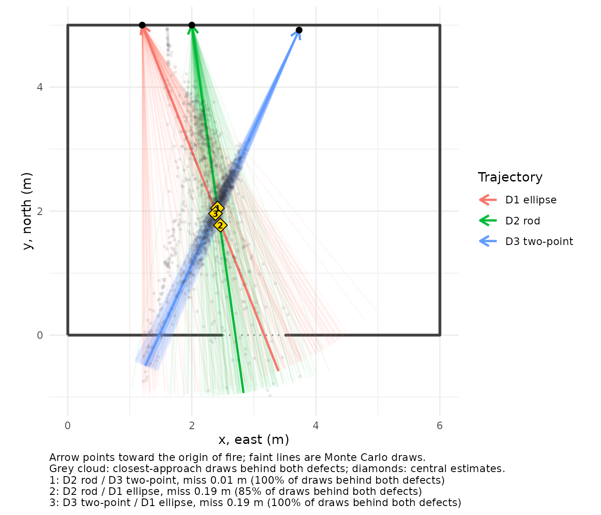
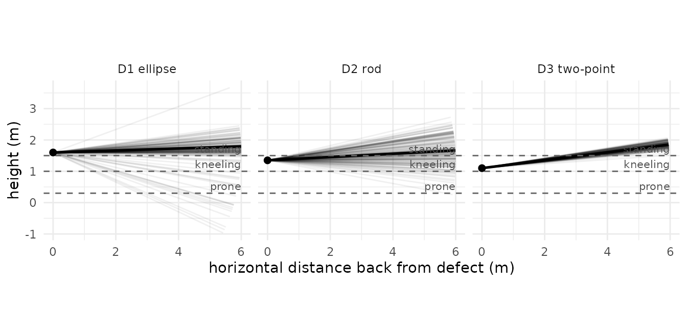
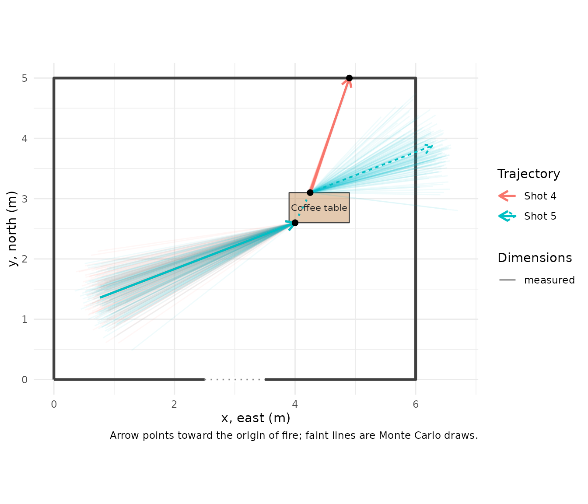

# Shooting reconstruction with explicit uncertainty

Shooting incident reconstruction answers a narrow question with
geometry: given the defects a bullet left, where could it have come
from? forensicR follows the standard field workflow (Haag & Haag,
*Shooting Incident Reconstruction*; Hueske, *Practical Analysis and
Reconstruction of Shooting Incidents*; OSAC 2025-N-0003 terminology) and
adds the one thing paper cannot: every result carries the uncertainty of
the measurements it came from.

Throughout, the frame is x east, y north, z up; azimuths are degrees
clockwise from north; a trajectory’s direction is the direction of
**flight**, and its **anchor** is the defect where the bullet struck.

## 1\. Impact angle from a defect

A bullet striking a flat, non-yielding surface leaves an elliptical
defect. The angle of impact relative to the surface is approximately
`asin(width / length)`. Measure both axes and give the measurement
error:

``` r
impact_angle(width = c(9.1, 6.0), length = c(9.3, 12.5), se = 0.5)
#> # A tibble: 2 × 4
#>   angle_deg lower upper level
#>       <dbl> <dbl> <dbl> <dbl>
#> 1      78.1  56.7  86.0  0.95
#> 2      28.7  23.3  34.7  0.95
```

Two things to notice. Near 90 degrees (a nearly round defect) the
interval is wide: the ellipse simply does not carry much information
there. And the method is only valid on surfaces that do not deform:
drywall, wood, sheet metal. Not glass, not fabric.

## 2\. Three ways to establish a trajectory

### Rod or laser angles at the defect

The most common method. Record the vertical angle (angle finder) and the
horizontal angle (protractor or total station), both as the direction of
flight. Five degrees is a commonly cited uncertainty for rods; use what
your validation supports.

``` r
t_rod <- trajectory_from_angles(anchor = c(2.0, 5.0, 1.35),
                                azimuth_deg = 352, vertical_deg = -3,
                                se_azimuth = 5, se_vertical = 5, id = "D2 rod")
t_rod
#> 
#> ── Trajectory D2 rod (angles at defect)
#> Anchor (x, y, z): 2, 5, 1.35
#> Flight azimuth: 352° ± 5° (clockwise from north)
#> Vertical angle: -3° ± 5° (downward flight)
```

### Two points on the path

Entry and exit of a wall, a defect and a probe tip, two defects in line.
Positional uncertainty is propagated to the angles. The trajectory is
anchored at the second point (the impact); the first is kept and becomes
the joint of a segmented path (section 6).

``` r
t_2pt <- trajectory_2pt(p1 = c(3.4, 4.2, 1.20), p2 = c(3.73, 4.92, 1.10),
                        se_position = 0.01, id = "D3 two-point")
t_2pt
#> 
#> ── Trajectory D3 two-point (two points)
#> Anchor (x, y, z): 3.73, 4.92, 1.1
#> Flight azimuth: 24.6° ± 1° (clockwise from north)
#> Vertical angle: -7.2° ± 1° (downward flight)
```

### A single defect’s ellipse plus directionality

When no rod can be placed. Needs the ellipse, the orientation of its
major axis on the wall (0 = vertical, 90 = horizontal, clockwise as seen
from the shooter’s side) and which end the bullet came from (lead-in
mark, pinch point). The wall’s facing direction fixes the frame.

``` r
t_ell <- trajectory_from_defect(anchor = c(1.2, 5.0, 1.60), width = 9.3, length = 10.0,
                                major_axis_deg = 85, wall_azimuth_deg = 180,
                                came_from = "right", se = 0.5, se_orientation = 5,
                                id = "D1 ellipse")
t_ell
#> 
#> ── Trajectory D1 ellipse (defect ellipse)
#> Anchor (x, y, z): 1.2, 5, 1.6
#> Flight azimuth: 338.5° ± 10.9° (clockwise from north)
#> Vertical angle: -1.8° ± 7° (downward flight)
trajs <- list(t_rod, t_2pt, t_ell)
trajectory_table(trajs)[, c("id", "method", "azimuth_deg", "se_azimuth", "vertical_deg", "se_vertical")]
#> # A tibble: 3 × 6
#>   id           method           azimuth_deg se_azimuth vertical_deg se_vertical
#>   <chr>        <chr>                  <dbl>      <dbl>        <dbl>       <dbl>
#> 1 D2 rod       angles at defect       352         5           -3           5   
#> 2 D3 two-point two points              24.6       1.01        -7.20        1.01
#> 3 D1 ellipse   defect ellipse         339.       10.9         -1.84        7.05
```

Compare the uncertainties: the two-point method with centimetre
positions is ten times tighter than the rod; the ellipse of a nearly
round defect is the loosest. The plots below show the same thing as
fans.

## 3\. Seeing the cone, not the line

``` r
walls <- rbind(room_rect(0, 0, 6, 5), opening(2.5, 0, 3.5, 0, "door"))
plot_trajectories(trajs, view = "plan", walls = walls, back = 6, convergence = TRUE)
```



``` r
plot_trajectories(trajs, view = "elevation", back = 6)
```



The dashed lines in the elevation view are assumed muzzle heights. Where
the fan crosses them is where a shooter of that posture could have been.

## 4\. Where was the shooter?

`origin_zone()` intersects the back-projected line with each assumed
height and reports the horizontal distance and position, with Monte
Carlo intervals. `max_distance` bounds the search to the scene;
`furniture` excludes positions inside objects.

``` r
origin_zone(t_rod, heights = c(standing = 1.5, kneeling = 1.0, prone = 0.3),
            max_distance = 12)
#> # A tibble: 3 × 9
#>   position height horizontal_distance hd_lower hd_upper     x      y p_reachable
#>   <chr>     <dbl>               <dbl>    <dbl>    <dbl> <dbl>  <dbl>       <dbl>
#> 1 standing    1.5                1.68    0.609     9.22  2.22  3.34       0.670 
#> 2 kneeling    1                  5.34    1.93     11.5   2.69 -0.273      0.179 
#> 3 prone       0.3                9.18    5.02     11.9   3.19 -4.06       0.0556
#> # ℹ 1 more variable: p_in_furniture <dbl>
```

`p_reachable` is the fraction of draws that reach that height within the
distance limit. A low value means the height is poorly supported by the
trajectory, and the interval is conditional on the draws that do reach
it. Report both numbers.

## 5\. Several shots: do they converge?

If two shots came from one position, their back-projected lines should
pass close to each other *behind* both defects.
`intersect_trajectories()` gives the closest approach, the miss distance
and whether it lies behind both defects, all with Monte Carlo spread.

``` r
ix <- intersect_trajectories(t_rod, t_2pt)
ix$point
#> [1] 2.414256 2.048407 1.502531
ix$miss_distance
#> [1] 0.007417332
ix$behind_both
#> [1] TRUE
ix$summary
#> # A tibble: 4 × 4
#>   quantity        lower median upper
#>   <chr>           <dbl>  <dbl> <dbl>
#> 1 x             1.90     2.43  2.73 
#> 2 y             0.947    2.13  2.79 
#> 3 z             1.24     1.50  1.80 
#> 4 miss_distance 0.00762  0.184 0.600
```

In this example the three defects were simulated from one shooter
standing at (2.4, 2.0, 1.5) and the reconstruction recovers that point
to a few centimetres. A small miss distance is consistent with, but does
not prove, a single firing position.

## 6\. Objects on the path

With the scene’s furniture, `trajectory_obstructions()` reports which
objects each back-projected line passes through and between which
distances. A hit means the object is an intermediate target (look for a
defect in it) or the path must be reconsidered.

``` r
furn <- rbind(along_wall(walls, "north", from = 3.4, length = 2.1, depth = 0.9, id = "Sofa", type = "sofa"),
              furniture("Floor lamp", "box", x = 1.95, y = 3.85, width = 0.3, depth = 0.3, height = 1.7))
trajectory_obstructions(trajs, furn, back = 6)
#> # A tibble: 1 × 5
#>   trajectory object      from    to top_height
#>   <chr>      <chr>      <dbl> <dbl>      <dbl>
#> 1 D2 rod     Floor lamp  0.86  1.16        1.7
```

## 7\. Segmented paths through intermediate targets

A bullet that passes through a table, a door or a wardrobe follows two
or more straight segments. Each segment is measured on its own; the path
orders them from the shooter’s side to the terminal defect and records
the joints (exit points).

``` r
seg_in  <- trajectory_from_angles(anchor = c(4.0, 2.6, 0.5), azimuth_deg = 69, vertical_deg = -30,
                                  id = "D4 into table")
seg_out <- trajectory_2pt(p1 = c(4.25, 3.1, 0.45), p2 = c(4.9, 5.0, 0.2), se_position = 0.01,
                          id = "D4 to wall")
shot4 <- trajectory_path(seg_in, seg_out, id = "Shot 4")
shot4
#> 
#> ── Trajectory path Shot 4: 2 segments
#> 1. D4 into table (angles at defect): azimuth 69°, vertical -30°
#> 2. D4 to wall (two points): azimuth 18.9°, vertical -7.1°
#> Joint 1 (first point of next segment): deflection 52.2° [43.6, 60.8]
path_deflections(shot4)[, c("joint", "deflection_deg", "lower", "upper", "miss_in", "miss_out", "joint_source")]
#> # A tibble: 1 × 7
#>   joint deflection_deg lower upper miss_in     miss_out joint_source            
#>   <int>          <dbl> <dbl> <dbl>   <dbl>        <dbl> <chr>                   
#> 1     1           52.2  43.4  60.5   0.411 0.0000000298 first point of next seg…
```

The deflection is the angle between the measured segments, with its
interval. `miss_in` and `miss_out` are the distances from the joint to
each segment’s line: if either is larger than your measurement
uncertainty allows, the documented segments do not actually meet at that
joint.

**Deflection is never predicted.** How much a bullet deviates when it
passes through something depends on the bullet, its velocity, the
material and the angle, and cannot be computed reliably from the scene.
When the path after an object was not documented, `assumed_segment()`
continues the incoming direction with a cone whose width *you* state. It
is flagged `ASSUMED` in every table and plot, drawn dashed, and refused
by `origin_zone()`.

``` r
shot5 <- trajectory_path(seg_in,
                         assumed_segment(seg_in, joint = c(4.25, 3.1, 0.45), length = 2.5,
                                         se_deflection = 10, id = "after table (assumed)"),
                         id = "Shot 5")
trajectory_table(shot5)[, c("id", "path", "segment", "assumed", "method")]
#> # A tibble: 2 × 5
#>   id                    path   segment assumed method            
#>   <chr>                 <chr>    <int> <lgl>   <chr>             
#> 1 D4 into table         Shot 5       1 FALSE   angles at defect  
#> 2 after table (assumed) Shot 5       2 TRUE    assumed deflection
plot_trajectories(list(shot4, shot5), view = "plan", walls = walls,
                  furniture = furniture("Coffee table", "table", x = 3.9, y = 2.6, width = 1.0, depth = 0.5),
                  back = 4)
```



For origin analysis and convergence, only the first segment of a path
(the one on the shooter’s side) is used.

## 8\. In three dimensions


The three trajectories of section 2 rendered to scale: rods with
arrowheads at the defects, wireframe cones for the angular uncertainty,
floor grid with numbered axes.

``` r
render_scene_3d(walls, NULL, trajs, file = "shooting.png", view = "dollhouse")
```

## 9\. What to write in the report

  - The **method** for each trajectory and the **uncertainty you
    assigned** to it, with the reason (validation study, manufacturer’s
    specification, rule of thumb).
  - Origin distances as **intervals at stated muzzle heights**, together
    with `p_reachable`, and the assumptions behind the heights.
  - Convergence as **consistent with**, never as proof of, a single
    position.
  - Any **assumed** segment as an assumption, separately from the
    evidence.

The report template does all of this by default; see
`vignette("reports-and-3d")`.
