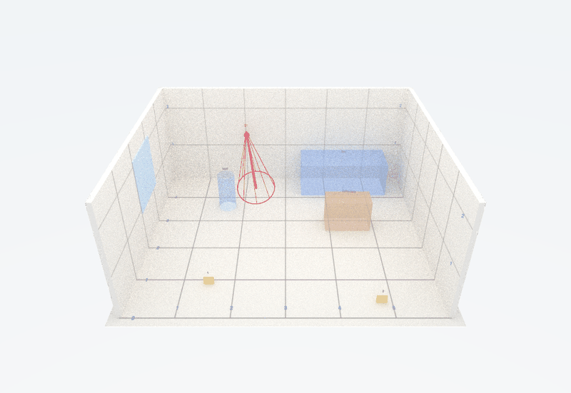

```{r, include = FALSE}
knitr::opts_chunk$set(collapse = TRUE, comment = "#>", fig.width = 7, fig.height = 5.5,
                      dpi = 96, out.width = "100%")
# on Linux the default X11 png device cannot draw semi-transparent fills; use cairo there
if (Sys.info()[["sysname"]] == "Linux" && isTRUE(capabilities("cairo"))) knitr::opts_chunk$set(dev.args = list(png = list(type = "cairo")))
set.seed(2026)
```

This vignette takes a single, small scene from field measurements to a
finished report. You do not need to know R beyond copying the code blocks
and changing the numbers. Everything here runs in a few seconds, except the
3D rendering at the end, which is optional.

**What forensicR does.** It turns the measurements a crime scene
investigator already takes (distances from walls and corners, defect
dimensions, rod angles) into to-scale diagrams, shooting reconstructions
with honest uncertainty, and a report in Word, PDF or HTML. It does not
replace your agency's forms or your judgement; it makes the geometry
reproducible and the uncertainty explicit.

## 1. The scene

A living room, 6 m by 5 m. One shot was fired; one cartridge case, one
firearm and one bullet defect in the north wall were documented. We use
**metres** throughout (any unit works as long as you are consistent), and a
coordinate frame where **x runs east, y runs north, and z is height above
the floor**. The south-west corner of the room is the origin (0, 0).

```{r setup}
library(forensicR)
```

### The room

`room_rect()` builds a rectangular room from its south-west corner and its
size. Doors and windows are added with `opening()`.

```{r room}
walls <- rbind(
  room_rect(x0 = 0, y0 = 0, width = 6, depth = 5),
  opening(2.5, 0, 3.5, 0, type = "door"),      # door in the south wall
  opening(0, 2.0, 0, 3.2, type = "window")     # window in the west wall
)
```

## 2. Evidence locations from your measurements

In the field you rarely measure x and y directly. You measure *along* a
reference line and *offset* from it (baseline method), or distances to two
fixed points (triangulation), or an angle and a distance from a total
station (polar). forensicR converts each of these to the same x, y frame.

Here the baseline runs along the south wall, from corner A at (0, 0) to
corner B at (6, 0). Each item is recorded as "distance along the baseline
from A" and "perpendicular distance into the room".

```{r points}
evidence <- coords_baseline(
  along  = c(1.5, 4.8),          # distance from corner A along the south wall
  offset = c(0.9, 0.4),          # distance into the room
  origin = c(0, 0), end = c(6, 0),
  id = c("1 Cartridge case", "2 Firearm")
)
evidence
```

The bullet defect is in the north wall. It was located by triangulation
from the two north corners, and its height was measured: 1.35 m. The
`z` argument records the height and `type = "defect"` tells the plots to
draw it as a bullet defect.

```{r defect}
defect <- coords_triangulation(
  d1 = 2.0, d2 = 4.0,                      # distances to the two reference points
  p1 = c(0, 5), p2 = c(6, 5),              # north-west and north-east corners
  side = "right",                          # inside the room when walking p1 -> p2
  id = "3 Bullet defect", z = 1.35, type = "defect"
)
defect
scene <- rbind(evidence, defect)
```

**Check yourself.** If a triangulation cannot close (the two distances do
not reach each other) you get a warning and `NA`, never a silently wrong
point.

## 3. Furniture, as it is measured

Objects are schematic boxes: a footprint and a height. The most natural way
to place something that stands against a wall is `along_wall()`: which
wall, the distance from the wall's left end (as you see it standing inside
the room), its length along the wall and its depth into the room.

```{r furniture}
furn <- rbind(
  along_wall(walls, "north", from = 3.4, length = 2.1, depth = 0.9, id = "Sofa", type = "sofa"),
  furniture("Coffee table", "table", x = 3.9, y = 2.6, width = 1.0, depth = 0.5,
            measured = FALSE),                      # estimated size: drawn dashed
  furniture("Stool", "chair", x = 1.6, y = 3.6, diameter = 0.4, shape = "circle")
)
furniture_table(furn)
```

Heights and colours come from `furniture_catalogue()`; pass `height =`,
`colour =` or `alpha =` to override them. Objects are semi-transparent by
default so nothing behind them is hidden.

## 4. The sketch

```{r sketch}
plot_scene(scene, walls = walls, furniture = furn)
```

This is a measurement check as much as a diagram: if a point lands outside
the room or inside a wall, a measurement or a conversion is wrong. Fix it
now, before anything is built on it.

Each wall can be drawn face-on as well, with the heights of what is on it:

```{r elevation, fig.height=3.8}
plot_wall_elevation(wall_from_room(walls, "north"), scene, walls = walls, furniture = furn)
```

## 5. One trajectory, with its uncertainty

A trajectory rod was placed in the defect. The angle finder read 3 degrees
downward and the protractor, relative to north, gave a flight azimuth of
352 degrees (the bullet was travelling almost due north when it struck the
wall). Rod readings are commonly taken to be good to about 5 degrees; that
uncertainty is part of the trajectory from the start.

```{r trajectory}
t1 <- trajectory_from_angles(
  anchor = c(defect$x, defect$y, defect$z),   # where the bullet struck
  azimuth_deg = 352, vertical_deg = -3,       # direction of flight
  se_azimuth = 5, se_vertical = 5,            # angular uncertainty
  id = "D1"
)
t1
```

### Where could the shooter have been?

A trajectory is a line. To turn it into a position you have to assume a
muzzle height. `origin_zone()` projects the line back until it reaches
each assumed height and gives the horizontal distance from the defect,
with an interval that comes from the angular uncertainty.

```{r origin}
origin_zone(t1, heights = c(standing = 1.5, kneeling = 1.0), max_distance = 6,
            furniture = furn)
```

Read this with the `p_reachable` column. For a nearly horizontal shot with
5 degrees of vertical uncertainty, a third of the Monte Carlo draws never
reach standing height within the room: the data genuinely do not pin the
distance down, and the report should say so rather than quote a single
number. Positions inside furniture are excluded automatically.

### Seeing the uncertainty

```{r plan}
plot_trajectories(t1, view = "plan", points = scene, walls = walls, furniture = furn,
                  back = 5)
```

The thick line is the central estimate; the faint fan is what the stated
uncertainty allows. The side view shows why height matters:

```{r elev, fig.height=3.2}
plot_trajectories(t1, view = "elevation", back = 5)
```

## 6. The evidence log

A minimal chain of custody, kept next to the report. Photos are hashed at
the moment they are logged so the report can show that the images are the
ones collected.

```{r log}
log <- evidence_log("2026-000123", "Example County Sheriff's Office")
log <- log_item(log, "1", "Cartridge case, 9 mm Luger", location = "Point 1",
                collected_by = "Investigator A", packaging = "Paper envelope, sealed")
log <- log_item(log, "2", "Pistol, 9 mm", location = "Point 2",
                collected_by = "Investigator A", packaging = "Firearm box, zip-tied")
log <- log_custody(log, "2", "submitted to lab", from = "Investigator A", to = "State lab")
log
```

## 7. The report

One template renders to Word, PDF and HTML. You pass the objects you built;
sections whose object is missing print a placeholder instead of failing.
Every output ends with a one-line note of the forensicR version used.

```{r report, eval = FALSE}
render_scene_report(
  output_dir = "case-2026-000123",
  formats = c("docx", "pdf", "html"),
  params = list(
    case_id = "2026-000123",
    agency = "Example County Sheriff's Office",
    investigator = "Investigator A",
    narrative = "Single-family residence, living room. One bullet defect in the north wall.",
    points = scene, walls = walls, furniture = furn,
    shooting = list(trajectories = list(t1), heights = c(standing = 1.5, kneeling = 1.0),
                    max_distance = 6),
    evidence = log,
    scene3d = TRUE          # adds the 3D view (see below)
  )
)
```

The Word file is meant to be edited: paste in your agency header, add
photographs, adjust wording. The numbers and figures come from the code, so
re-running after a corrected measurement regenerates everything
consistently.

## 8. Optional: the scene in 3D

With the `rayrender` package installed, the same objects render as a
schematic, to-scale 3D model. With `rgl`, the HTML report gets an
interactive version you can rotate. Both are optional dependencies.

```{r render3d, eval = FALSE}
render_scene_3d(walls, scene, t1, furniture = furn, file = "scene3d.png", view = "dollhouse")
```

```{r fig3d, echo = FALSE, out.width = "100%", fig.cap = "Dollhouse view: south wall removed, numbered floor grid, bullet defect at its measured height, trajectory rod with its uncertainty cone."}

```

The rendering is deliberately schematic. A demonstrative exhibit must be
accurate to scale and must not add detail that was not measured, so there
are no realistic textures, no blood, no bodies: boxes, discs, rods and
numbers.

## Where to go next

- `vignette("scene-mapping")`: the three measurement methods, conventions,
  walls that are not rectangles, elevations, exporting points.
- `vignette("shooting-reconstruction")`: impact angles from defects, the
  three ways to establish a trajectory, convergence of several shots,
  objects on the path, segmented paths through intermediate targets.
- `vignette("reports-and-3d")`: everything the report template accepts,
  customising it, the 3D views and the interactive widget.
